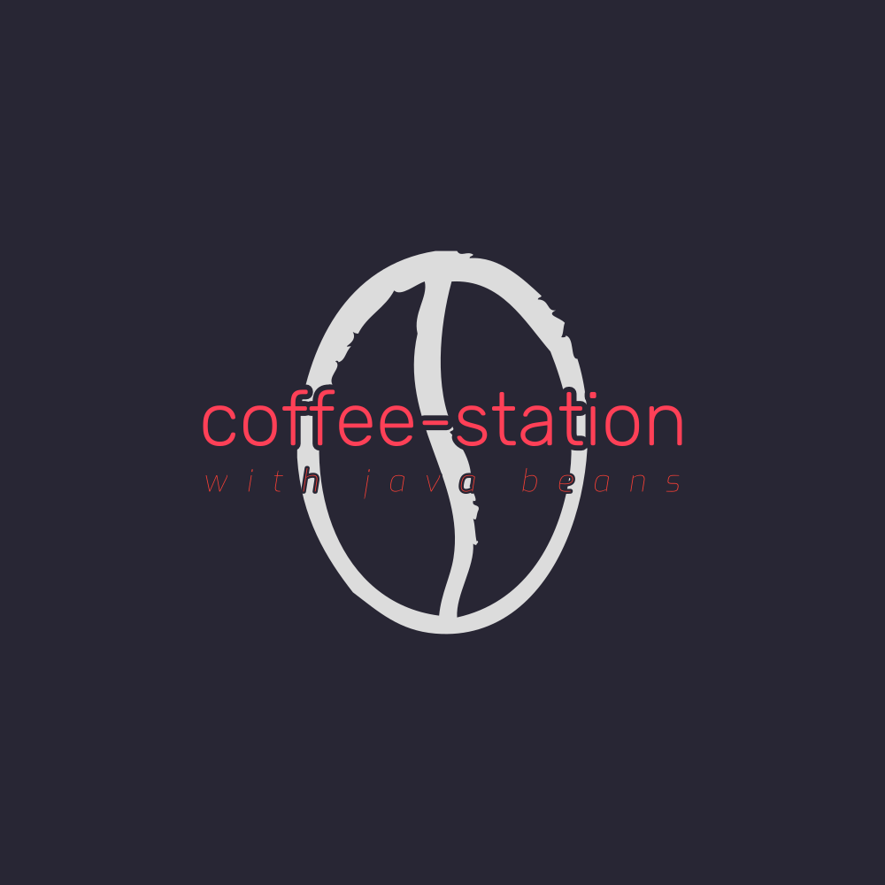

<a name="readme-top"></a>
[![Contributors][contributors-shield]][contributors-url]
[![Forks][forks-shield]][forks-url]
[![Stargazers][stars-shield]][stars-url]
[![Issues][issues-shield]][issues-url]
[![MIT License][license-shield]][license-url]
[![LinkedIn][linkedin-shield]][linkedin-url]
<br />
<div align="center">
  <a href="https://github.com/freemanpivo/coffee-station">
    
  </a>

<h3 align="center">Coffee Station</h3>

  <p align="center">
    Its a simple project to exercise microservice concepts, study, implement, use ddd, api design, observability tools, languages and frameworks of @freemanpivo skill set
    <br />
    <a href="https://github.com/freemanpivo/coffee-station"><strong>Explore the docs »</strong></a>
    <br />
    <br />
    <a href="https://github.com/freemanpivo/coffee-station">View Demo</a>
    ·
    <a href="https://github.com/freemanpivo/coffee-station/issues">Report Bug</a>
    ·
    <a href="https://github.com/freemanpivo/coffee-station/issues">Request Feature</a>
  </p>
</div>

<!-- TABLE OF CONTENTS -->
<details>
  <summary>Table of Contents</summary>
  <ol>
    <li>
      <a href="#about-the-project">About The Project</a>
      <ul>
        <li><a href="#built-with">Built With</a></li>
      </ul>
    </li>
    <li>
      <a href="#getting-started">Getting Started</a>
      <ul>
        <li><a href="#prerequisites">Prerequisites</a></li>
        <li><a href="#installation">Installation</a></li>
      </ul>
    </li>
    <li><a href="#usage">Usage</a></li>
    <li><a href="#roadmap">Roadmap</a></li>
    <li><a href="#contributing">Contributing</a></li>
    <li><a href="#license">License</a></li>
    <li><a href="#contact">Contact</a></li>
    <li><a href="#acknowledgments">Acknowledgments</a></li>
  </ol>
</details>

## About The Project

<div align="center">
  
  Currently building... 🏗️
</div>

<p align="right">(<a href="#readme-top">back to top</a>)</p>

### Built With

[![Java][JavaShield]][JavaUrl]
[![Kotlin][KotlinShield]][KotlinUrl]
[![RabbitMQ][RabbitMQShield]][RabbitMQUrl]
[![DynamoDB][DynamoDBShield]][DynamoDBUrl]
[![Postgres][PostgresShield]][PostgresUrl]
[![S3][S3Shield]][S3Url]
[![Jaeger][JaegerShield]][JaegerUrl]
[![Prometheus][PrometheusShield]][PrometheusUrl]
[![Grafana][GrafanaShield]][GrafanaUrl]
[![Docker][DockerShield]][DockerUrl]
[![Terraform][TerraformShield]][TerraformUrl]
[![Datadog][DatadogShield]][DatadogUrl]

<p align="right">(<a href="#readme-top">back to top</a>)</p>

<!-- GETTING STARTED -->
## Getting Started

Currently building... 🏗️

### Prerequisites

- OpenJDK 17
- Terraform
- Docker
- Go

### Installation

1. Clone the repo
   ```sh
   git clone https://github.com/freemanpivo/coffee-station.git
   ```
2. Run Docker
   ```sh
   docker-compose up
   ```

<p align="right">(<a href="#readme-top">back to top</a>)</p>


<!-- USAGE EXAMPLES -->
## Usage

Currently building... 🏗️
<p align="right">(<a href="#readme-top">back to top</a>)</p>

<!-- ROADMAP -->
## Roadmap

Currently building... 🏗️

- [ ] Basic Infra
- [ ] Product Service
- [ ] Payment Service
- [ ] Notification Service
- [ ] ChargeCard Service
- [ ] Kitchen Service
- [ ] Barista Service
- [ ] Order Service
- [ ] Frontend

See the [open issues](https://github.com/freemanpivo/coffee-shop/issues) for a full list of proposed features (and known issues).

<p align="right">(<a href="#readme-top">back to top</a>)</p>

<!-- LICENSE -->
## License

Distributed under the MIT License. See `LICENSE.txt` for more information.

<p align="right">(<a href="#readme-top">back to top</a>)</p>

<!-- CONTACT -->
## Contact

Pedro Ivo de Andrade - [@freemanpivo](https://github.com/freemanpivo)

Project Link: [https://github.com/freemanpivo/coffee-station](https://github.com/freemanpivo/coffee-station)

<p align="right">(<a href="#readme-top">back to top</a>)</p>

<!-- ACKNOWLEDGMENTS -->
## Acknowledgments

* [Thanks to @othneildrew for providing this README template](https://github.com/othneildrew/Best-README-Template)
* []()
* []()

<p align="right">(<a href="#readme-top">back to top</a>)</p>

<!-- https://www.markdownguide.org/basic-syntax/#reference-style-links -->

<!-- MARKDOWN BADGES -->
[JavaShield]: https://img.shields.io/badge/java-darkblue?style=for-the-badge&logo=openjdk&logoColor=white
[JavaUrl]: https://openjdk.org/
[KotlinShield]: https://img.shields.io/badge/kotlin-purple?style=for-the-badge&logo=kotlin&logoColor=orange
[KotlinUrl]: https://kotlinlang.org/
[RabbitMQShield]: https://img.shields.io/badge/rabbitmq-orange?style=for-the-badge&logo=rabbitmq&logoColor=white
[RabbitMQUrl]: https://www.rabbitmq.com/
[DynamoDBShield]: https://img.shields.io/badge/amazon%20dynamodb-grey?style=for-the-badge&logo=amazondynamodb&logoColor=white
[DynamoDBUrl]: https://aws.amazon.com/dynamodb/
[PostgresShield]: https://img.shields.io/badge/postgresql-lightblue?style=for-the-badge&logo=postgresql&logoColor=black
[PostgresUrl]: https://www.postgresql.org
[S3Shield]: https://img.shields.io/badge/amazon%20s3-white?style=for-the-badge&logo=amazons3&logoColor=orange
[S3Url]: https://aws.amazon.com/pt/s3/
[JaegerShield]: https://img.shields.io/badge/jaeger-lightblue?style=for-the-badge&logo=go&logoColor=blue
[JaegerUrl]: https://www.jaegertracing.io/
[PrometheusShield]: https://img.shields.io/badge/prometheus-grey?style=for-the-badge&logo=prometheus&logoColor=orange
[PrometheusUrl]: https://prometheus.io/
[GrafanaShield]: https://img.shields.io/badge/grafana-black?style=for-the-badge&logo=grafana&logoColor=orange
[GrafanaUrl]: https://grafana.com/
[DockerShield]: https://img.shields.io/badge/docker-white?style=for-the-badge&logo=docker&logoColor=blue
[DockerUrl]: https://www.docker.com/
[TerraformShield]: https://img.shields.io/badge/terraform-purple?style=for-the-badge&logo=terraform&logoColor=white
[TerraformUrl]: https://www.terraform.io/
[DatadogShield]: https://img.shields.io/badge/datadog-blue?style=for-the-badge&logo=datadog&logoColor=purple
[DatadogUrl]: https://www.datadoghq.com/
<!-- MARKDOWN BADGES -->

<!-- MARKDOWN LINKS -->
[contributors-shield]: https://img.shields.io/github/contributors/freemanpivo/coffee-station.svg?style=for-the-badge
[contributors-url]: https://github.com/freemanpivo/coffee-station/graphs/contributors
[forks-shield]: https://img.shields.io/github/forks/freemanpivo/coffee-station.svg?style=for-the-badge
[forks-url]: https://github.com/freemanpivo/coffee-station/network/members
[stars-shield]: https://img.shields.io/github/stars/freemanpivo/coffee-station.svg?style=for-the-badge
[stars-url]: https://github.com/freemanpivo/coffee-station/stargazers
[issues-shield]: https://img.shields.io/github/issues/freemanpivo/coffee-station.svg?style=for-the-badge
[issues-url]: https://github.com/freemanpivo/coffee-station/issues
[license-shield]: https://img.shields.io/github/license/freemanpivo/coffee-station.svg?style=for-the-badge
[license-url]: https://github.com/freemanpivo/coffee-station/blob/master/LICENSE.txt
[linkedin-shield]: https://img.shields.io/badge/-LinkedIn-black.svg?style=for-the-badge&logo=linkedin&colorB=555
[linkedin-url]: https://www.linkedin.com/in/andradepedroivo/
[product-screenshot]: images/building.jpg
<!-- MARKDOWN LINKS -->